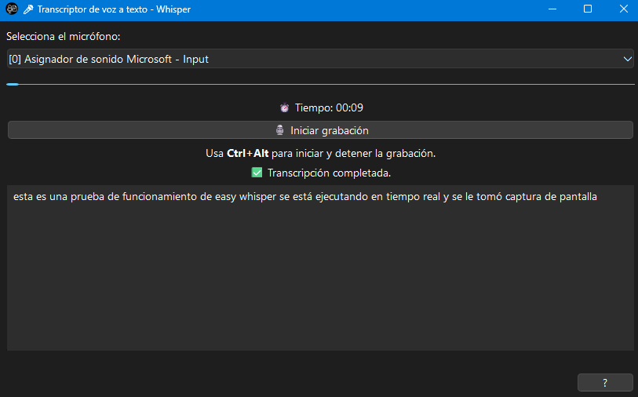

# 🎤 Easy Whisper: Transcripción de voz a texto con interfaz gráfica

**Easy Whisper** es una aplicación de escritorio que convierte tu voz en texto utilizando inteligencia artificial. Desarrollada con Python y la biblioteca Whisper de OpenAI, ofrece una interfaz gráfica sencilla y eficiente.



---

## 🛠️ Instalación

### 1. Crear un entorno virtual con Miniconda

Para mantener las dependencias organizadas, es recomendable crear un entorno virtual con Miniconda:

```bash
conda create -n easy_whisper
conda activate easy_whisper
```
### 2. Instalar Pytorch con soporte de CUDA (opcional si se tiene una GPU NVIDIA)
 Ver comandos de instalación según la versión de CUDA disponible en tu sistema (https://pytorch.org/get-started/locally/).

 Ejemplo: 
```bash
pip3 install torch torchvision torchaudio --index-url https://download.pytorch.org/whl/cu124
```
### 3. Instalar Whisper
Para utilizar Whisper,seguir la instrucciones desde el repositorio oficial de OpenAI (https://github.com/openai/whisper/tree/main).

Ejemplo:

Usando pip:
```bash
pip install -U openai-whisper
```

Desde el repositorio (recomendado para GPU):
```bash
pip install git+https://github.com/openai/whisper.git 
```

### 4. Instalar las dependencias adicionales
Instala las siguientes bibliotecas necesarias para el funcionamiento de la aplicación:
```bash
pip install pyside6 sounddevice numpy pyautogui keyboard
```

## 🚀 Uso
### 1. Activa el entorno virtual:
```bash
conda activate easy_whisper
```
### 2. Ejecuta la aplicación:
```bash
python main.py
```

## 📚 Instrucciones de uso
<p>1. 🔧 <b>Selecciona tu micrófono</b> en la lista desplegable.</p>
<p>2. 🎙️ Habla normalmente y presiona <b><u>Ctrl + Alt</u></b> para <b>comenzar o detener</b> la grabación.</p>
<p>3. 📋 El texto transcrito se copiará automáticamente y se pegará en la aplicación que tengas activa.</p>
<p>4. 🔵 La <b>barra azul</b> muestra la intensidad del sonido detectado (más alta = estás hablando).</p>
<p>5. 🎛️ También puedes usar el botón de la interfaz para controlar manualmente la grabación.</p>
<h4>ℹ️ La transcripción puede tardar unos segundos al terminar de hablar.</h4>


## 📄 Licencia
Esta aplicación está disponible bajo la **GNU Affero General Public License v3.0 (AGPL-3.0)**. Consulta el archivo [LICENSE](LICENSE) para obtener más detalles sobre los términos y condiciones de esta licencia.

##